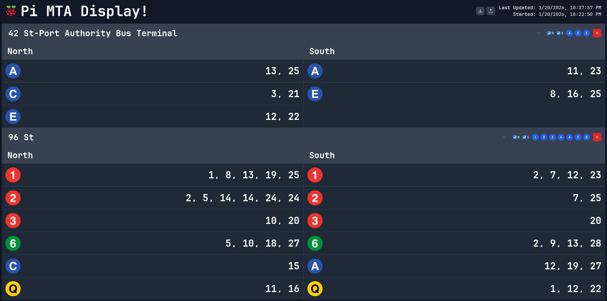

# Pi MTA Sign!

This project gives you a docker image that you can run locally to pull MTA data and self-host a webpage that looks very
similar to the classic MTA Signs found in the metro.



Initially designed to run directly on a raspberry pi, it has been containerized and now runs anywhere you can install
podman or docker!

Additionally, this can be run without the frontend in case you just wanted a slightly more sane way to query MTA's data
sources compared to their stock APIs.

## Features

- **Real-time MTA Data**: Live train arrival times for NYC subway
  stations - [available for free here](https://api.mta.info/#/subwayRealTimeFeeds)
- **Configurable Stations**: Monitor multiple stations simultaneously with separate cards
- **Line Filtering**: Show/hide specific transit lines for each station
- **Direction Selection**: Toggle between North/South bound trains independently
- **Responsive Design**: Works on desktop, tablet, and mobile displays
- **Configuration Persistence**: Save your selected stations and preferences to localStorage or export/import them via
  JSON
- **Docker Ready**: Easy deployment with Docker or Docker Compose

## Running the Docker Image

### Prerequisites

- Docker installed on your system

### Quick Start with Docker

Pull the latest image from GitHub Container Registry:

```bash
docker pull ghcr.io/lucasoskorep/pi-mta-sign:latest
```

Run the container:

```bash
docker run -d \
  -p 8000:8000 \
  --name pi-mta-sign \
  ghcr.io/lucasoskorep/pi-mta-sign:latest
```

The application will be available at `http://localhost:8000`

### Environment Variables

| Variable          | Description                     | Default | Required |
|-------------------|---------------------------------|---------|----------|
| `FRONTEND_ENABLE` | Enable/disable the web frontend | `true`  | No       |

### Running with Docker Compose

For a more convenient setup, use the provided docker-compose configuration:

```bash
# Copy the example docker-compose.yaml from the docker folder
cp docker/docker-compose.example.yaml docker-compose.yaml

# Run with docker-compose
docker-compose up -d
```

See `docker/docker-compose.example.yaml` for a complete example configuration.

### Local Development

To develop on this app locally you can clone the repo and then in the repo root run the following

Tools needed:

- [just](https://github.com/casey/just)
- [uv](https://github.com/astral-sh/uv)
- [fnm](https://github.com/Schniz/fnm)

Once you have all the required tooling all you need to do is

```bash
just init # downloads python 

just dev # this will spin up the nextjs frontend and fastapi backend in hot reload mode
```
